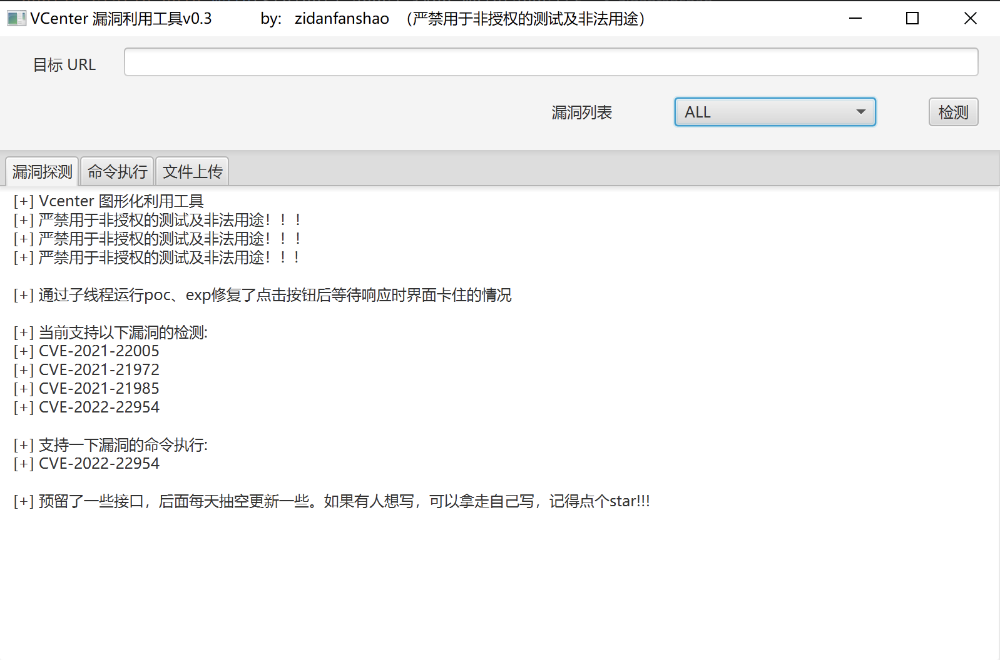

# 更新记录

```
v0.3    2024年11月13日   添加了cve-2022-22954的检测和命令执行。通过创建子线程修复了点击按钮后等待响应时页面卡住的情况。
v0.2    2024年11月12日   完成了命令执行和文件上传的图形化功能，后端具体漏洞利用下一版本写，然后就基本可以用了。
v0.1    2024年11月11日   完成了图形化界面的创建以及3个漏洞（CVE-2021-22005，CVE-2021-21972，CVE-2021-21985）的检测。
```
# vcenter_tools 功能

当前支持以下漏洞的检测：

CVE-2021-22005

CVE-2021-21972

CVE-2021-21985

cve-2022-22954

当前支持以下漏洞的命令执行：

cve-2022-22954

# 介绍

年初学习java时写了一个带命令执行和上传文件的，一直没什么机会用，本来不打算继续写的。

结果前段时间公司内部搞红蓝，还碰到了不少低版本的，命令行的有时候又很麻烦，还是喜欢无脑点点点的。

电脑上东西太多了，之前的好几个版本的源码懒得看哪个最新的，于是打算重新写一个，扔到这，随时能改。

部分漏洞检测、利用逻辑如果有问题，直接提lssues.有空了会看。

预留了一些接口，后面每天抽空更新一些。如果有人想写，可以拿走自己写，记得点个star!!!

# 环境

jdk >= 11.0.1

# 界面


