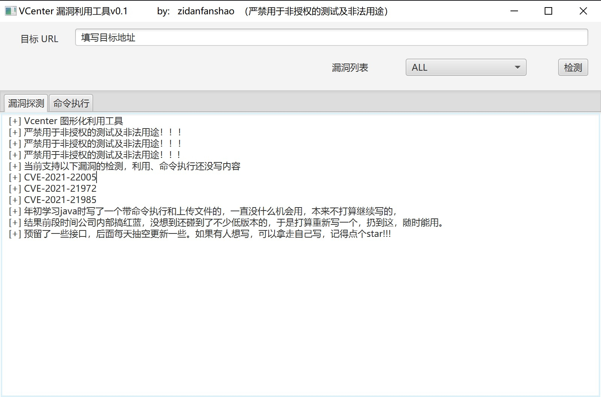

# vcentertools

当前支持以下漏洞的检测，利用、命令执行还没写内容

CVE-2021-22005

CVE-2021-21972

CVE-2021-21985

年初学习java时写了一个带命令执行和上传文件的，一直没什么机会用，本来不打算继续写的。

结果前段时间做了次项目，没想到在内网中还碰到了不少低版本的，命令行的有时候又很麻烦，还是喜欢无脑点点点的。

电脑上东西太多了，之前的好几个版本的源码懒得看哪个最新的，于是打算重新写一个，扔到这，随时能改。

预留了一些接口，后面每天抽空更新一些。如果有人想写，可以拿走自己写，记得点个star!!!

# 环境

jdk >= 11.0.1

# 界面

